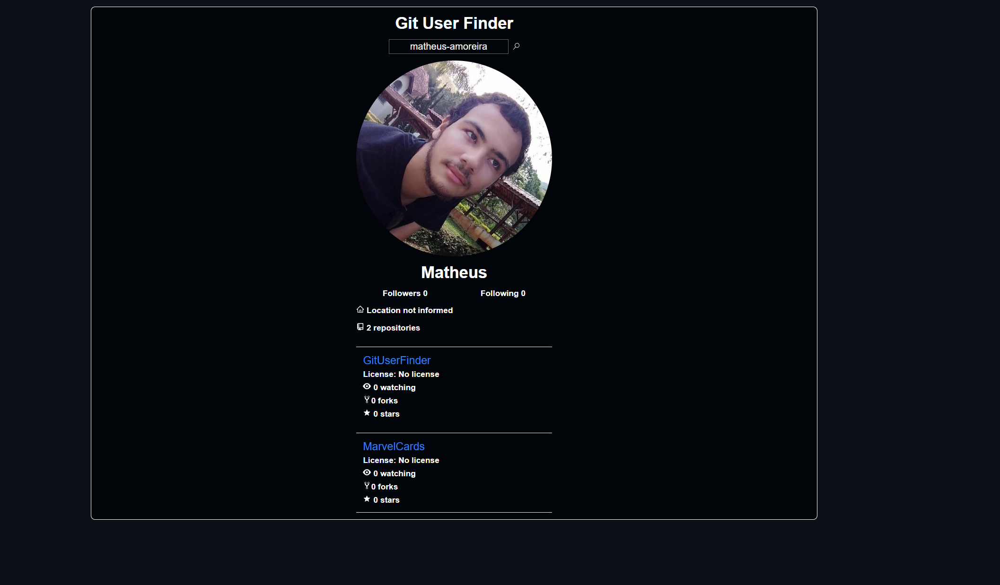

## 💻 Projeto

Se trata de uma site onde você pode pesquisar os usuários do github através da [api](https://docs.github.com/pt/rest) do próprio github e ver seus melhores projetos do usuário.

  

## 🚀 Tecnologias

Projeto desenvolvido com :

- HTML e CSS
- [Typescript](https://www.typescriptlang.org/)
- [Node e NPM](https://nodejs.org/)
- [Vite](https://vitejs.dev/)
- [React](https://react.dev/)